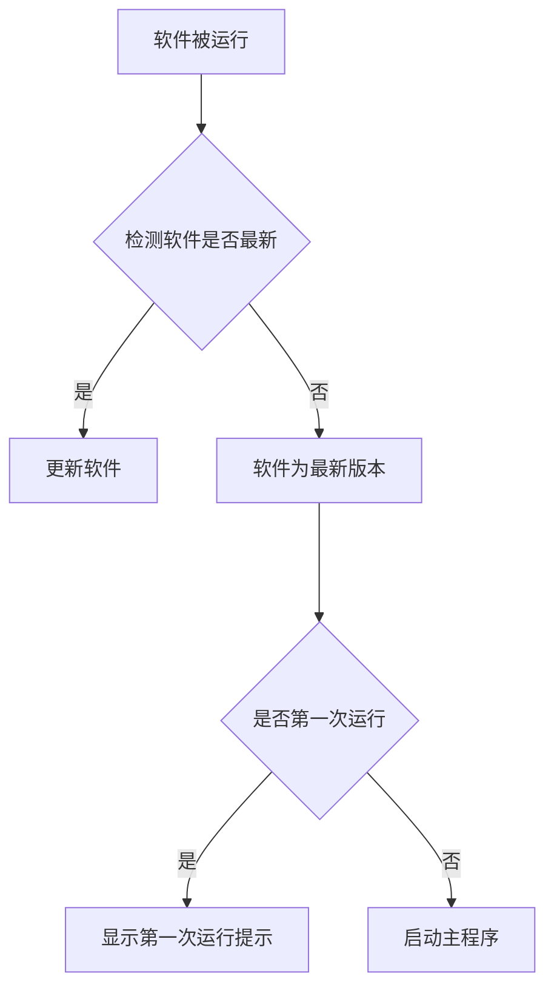

# 这是一篇 *网易云音乐第三方程序* 的提示词

## 软件目标

1. - 实现软件可利用网易云api下载音乐(可让用户自主设置下载的文件存放在哪)
2. - 可在软件内播放音乐
3. - `%apptata%/netHEmusic/`为软件的数据存放区,存放config文件

## 软件其它要求

- 包含 浅色 深色 等主题切换功能
  ### UI设计
- Windows11风格,圆角,现代化UI
- 程序按钮若我无特殊要求全使用 SVG 实现
- 在头像(以下称作个人资料)右侧放置 [用户VIP状态][主题][设置][最小化][最大化][关闭]
- 个人资料左侧(从软件最左侧开始) [Logo][返回][前进][搜索框]

```示例
┌─ 顶部栏 ─────────────────────────────────────────────────────────────────────────────────────────┐
│ [Logo][返回/前进]  [🔍搜索框]    ...   [个人资料头像][名称] [VIP][主题][设置][最小化][最大化][关闭]│
├───────┬─────────────────────────────────────────────────────────────────────────────────────────┤
```

## 关于按钮

- 右上角放置用户头像(使用api获取头像),可点击,点击后进入登录界面(若没登录)
- 个人资料界面在登录后不能进入(因为登录后不能再二次登录)
- 设置按钮里放置退出登录按钮

### 设置

- 软件设置界面,可设置下载路径,主题切换,软件更新等
- 该界面最下方放置一个退出登录按钮,点击后会清除用户登录信息,并返回登录界面

---
以下是软件初次运行流程

---
**附加**
在 `"D:\hyzhehehe\Desktop\Python\参考文档"` 存放了一些参考代码
在 `"D:\hyzhehehe\Desktop\Python\网易云音乐下载器\api-enhanced-4.40.0"`存放了网易云音乐api的项目源码,寻找工作文档部分阅读
项目的API访问调用地址`http://8.166.131.193:3000/`,使用该地址访问网易云音乐api,可在软件中实现搜索歌曲,获取歌曲信息,获取歌曲下载地址等功能,查看API文档以了解更多开发内容

- 右侧边缘隐约可见滚动条痕迹，说明列表可上下滚动。
- 整体配色为深棕黑背景 + 橙色强调色 + 灰白文字，属于暗色皮肤。
- 界面中存在"[Logo]""[当前播放歌曲名称]"等占位文本，表明这很可能是一张**UI 设计稿/原型图或模板截图**，而非真实运行截图。
- 搜索内容与歌曲内容均与日本企划《BanG Dream!》旗下乐队 MyGO!!!!!、Ave Mujica 相关（"焚音打""壱雫空""顔"等均为其曲目/专辑）。

总体而言，这是一张深色音乐播放器"搜索结果页"的界面图，包含完整的顶部导航与搜索、左侧功能栏、中部歌曲结果列表以及底部正在播放的控制条。
```